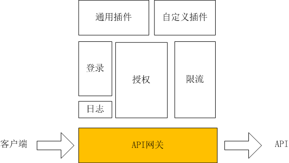
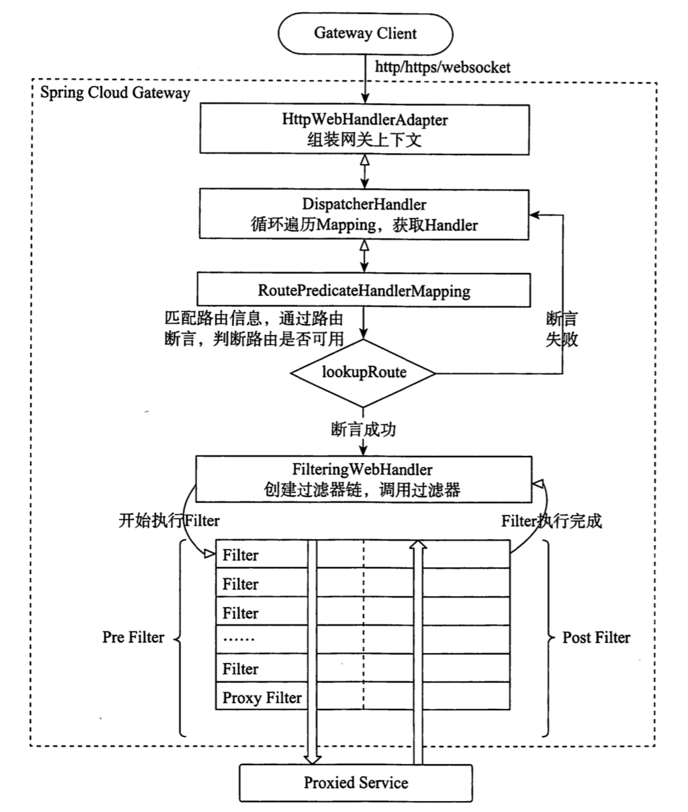

# Spring Cloud Gateway

## 1. 网关可以解决什么问题

 	1. 客户端会多次请求不同的微服务，增加了客户端的复杂性。
 	2. 存在跨域请求，在一定场景下处理相对复杂。
 	3. 认证复杂，每个服务都需要独立认证。
 	4. 难以重构，随着项目的迭代，可能需要重新划分微服务。例如，可能将多个服务合并成一个或者将一个服务拆分成多个。如果客户端直接与微服务通信，那么重构将会很难实施。

## 2. 引入网关后

**优点**：

1. 易于监控。可以在网关收集监控数据并将其推送到外部系统进行分析。
2. 易于认证。可以在网关上进行认证，然后再将请求转发到后端的微服务，而无须在每个微服务中进行认证。
3. 减少了客户端与各个微服务之间的交互次数。

## 3. Spring Cloud Gateway工作原理

### 1. 三个基本概念

**路由(route)**：网关最基本的组成部分。由ID、目标URI、断言和过滤器组成。

**断言(Predicate)：**简单来说他就是匹配条件。

**过滤器(filter):** Filter是Gateway中的过滤器，可以在请求发出前后进行一些业务上的处理。

### 2. WebFlux

WebFlux是一个典型非阻塞异步的框架，它的核心是基于Reactor的相关API实现的。相对于传统的web框架来说，它可以运行在诸如Netty，Undertow及支持Servlet3.1的容器上，因此它的运行环境的可选择行要比传统web框架多的多。

**框架思想**：响应式编程框架主要采用了观察者模式，而Spring Reactor的核心则是对观察者模式的一种衍伸。

1. 和传统MVC框架的区别

2. Mono和Flux

   **Mono**：实现了 org.reactivestreams.Publisher 接口，代表0到1个元素的发布者（Publisher）。

   **Flux**：实现了 org.reactivestreams.Publisher 接口，代表0到N个元素的发布者（Publisher）。

3. WebFlux工作原理(5个重要的接口)

   **WebServer**

   **ReactiveWebServerFactory**

   **HttpHandler**

   **WebHandler**

   **HandlerMapping**

4. 常用API

   | 发布者 | api                                                          | 功能                                                         |      |
   | ------ | ------------------------------------------------------------ | ------------------------------------------------------------ | ---- |
   | Mono   | just(T data)                                                 | 创建对象。                                                   |      |
   |        | justOrEmpty(Optional<? extends T> data) justOrEmpty(T data) | 从一个 Optional 对象或可能为 null 的对象中创建 Mono。只有 Optional 对象中包含值或对象不为 null 时，Mono 序列才产生对应的元素。 |      |
   |        | switchIfEmpty([Publisher](http://www.reactive-streams.org/reactive-streams-1.0.2-javadoc/org/reactivestreams/Publisher.html?is-external=true)<? extends [T](http://reactivex.io/RxJava/2.x/javadoc/io/reactivex/Flowable.html)> other) | 处理Mono.empty()逻辑。                                       |      |
   |        | flatMap(Function func)                                       | 有序合并。                                                   |      |
   | Flux   | just(T... data)                                              | 创建对象。                                                   |      |
   |        | flatMap(Function func)                                       | 无序合并。                                                   |      |
   |        | concatMap(Function func)                                     | 有序合并。                                                   |      |
   |        | next()                                                       | Flux转Mono。                                                 |      |
   |        | fromIterable(Iterable it)                                    | 创建对象。                                                   |      |

### 3. 工作流程

 	1. ReactorHttpHandlerAdapter首先将HttpServerRequest和HttpServerResponse转换成ReactorServerHttpRequest和ReactorServerHttpResponse。
 	2. HttpWebHandlerAdapter将ReactorServerHttpRequest和ReactorServerHttpResponse包装为ServerWebExchange。
 	3. DispatcherHandler通过Gateway中的RoutePredicateHandlerMapping找到对应的WebHandler，即FilteringWebHandler，并将匹配到的Route设置到attribute中。
 	4. FilteringWebHandler拿到ServerWebExchange，取出Route对象，拿出Route中配置的Filter，然后组合GlobalFilter执行FilterChain，其中NettyRoutingFilter和NettyWriteResponseFilter中完成了请求的转发和响应的处理。

